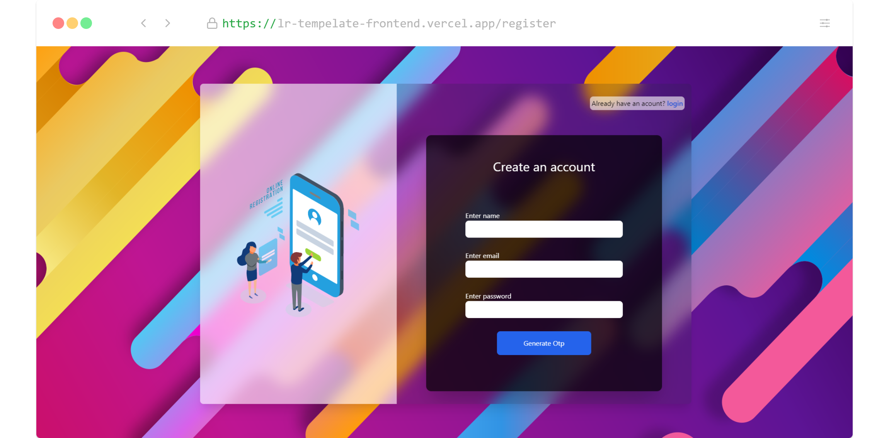
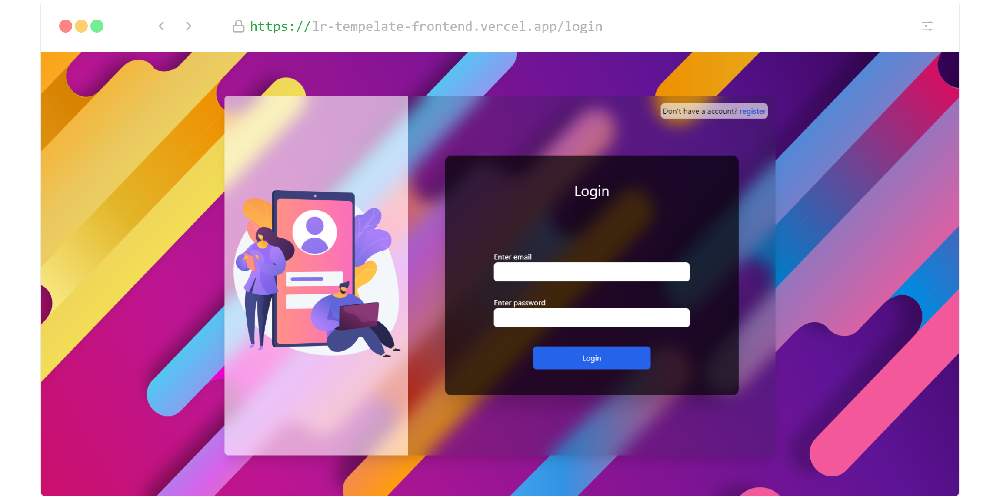
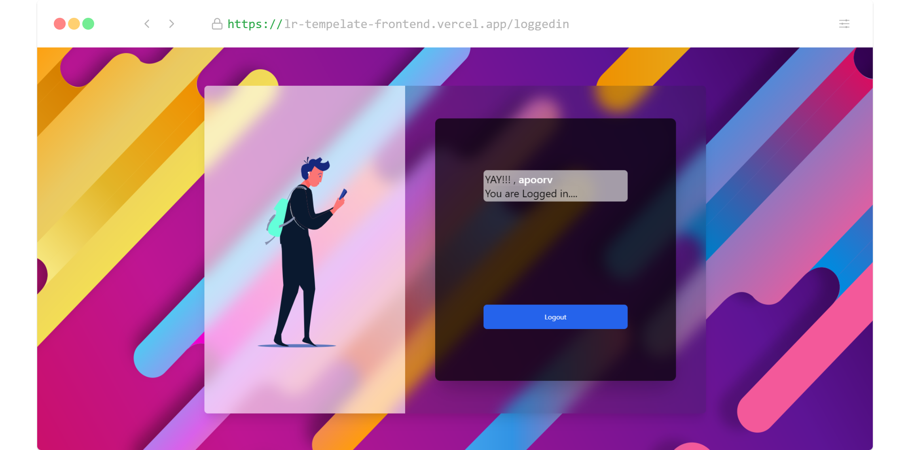
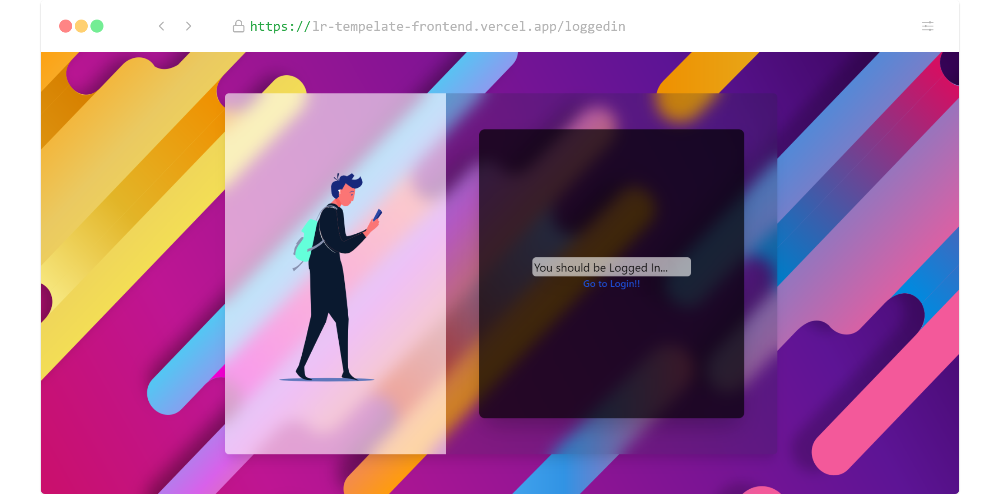

<div>

# Login and Registration Form Using MERN stack, Redux, jwt and2 step verification

<a href="https://lr-tempelate-frontend.vercel.app/"
 alt="Try the Demo on Vercel!">




</a>

> Before you continue, try the demo: https://ay-todoapp.vercel.app/ <br />

> A login and signup form which allows users to register and login.
> All information is stored in MongoDB.
> After successful login the user is redirected to their dashboard.
> User Password is stored and fetched as encrypted for security.
> Email is verified by sending otp to user's mail ,to check wether email is genuine or not.
> Once you have had a "play" with the demo, come back and _build_ it!!

<hr />

## What?

Build a fully functional Login and Registration Form! <br />

- [x] Building an App using MERN stack where React and Next.js for frontend and node.js with expressjs & mongoosejs for backend!
- [x] MongoDB as database
- [x] UI build using tailwindcss!
- [x] State Management with Redux!
- [x] Password encyption using bcryptjs!
- [x] Logged IN checking using a token by using jwt(jsonwebtoken)!
- [x] Email verification done using nodemailer!
- [x] Animations made using Famer Motion Api!
- [x] Animated icons and svg using lottie!

## _Who?_

This repo is for anyone/everyone who wants
to use this login and registration form or create their own.Also, anyone who wants to see authentication is done using email verification and password encyption for security.

## _How?_

Start by cloning this repository to your `localhost`
so that you can follow the example/tutorial offline:

```sh
git clone https://github.com/Apoorvssj/TodoApp.git
```

Install the `devDependencies` so you can run the tests:

```sh
 npm install
```

### Set Up your env for backend

- In backend folder create a .env file and variables given below.

* Create your db collection in mongoDB and connect it to your app thourgh setting up an environment variable in .env file

```env
mongo_url = "your collection url"
```

- Create your jwt key variable in your env

```env
jwt_key = "set any key you want"
```

- Add email and password in env from which verification emails are to sent

```env
emailID = "gmail id"
password = "password"
```

### Set Up your env for frontend

- In frontend folder create a .env.local file and variables given below.

```env
//for local port
NEXT_PUBLIC_BACKEND_API_PATH = http://localhost:3000/api

//for production set port to your deployed url
NEXT_PUBLIC_BACKEND_API_PATH = "deployed app url"
```

### Set Up your smtp server for email verification functionality

- In "./backend/api/routes/otp.js"
- - when in development

```js
let mailTransporter = nodemailer.createTransport({
  host: "gmail",
  auth: {
    user: `${user}`,
    pass: `${pass}`,
  },
});
```

- - when in production

```js
let mailTransporter = nodemailer.createTransport({
  port: 587,
  host: "smtp.gmail.com",
  auth: {
    user: `${user}`,
    pass: `${pass}`,
  },
});
```

- - Note: We are using gmail as our smtp server, which is less secure than a custom smtp server as said on nodemailer docs. So if you can host your own smtp server , please use that.

Now you have _everything_ you need to start this Tempelate !

```sh
 npm run dev
```
